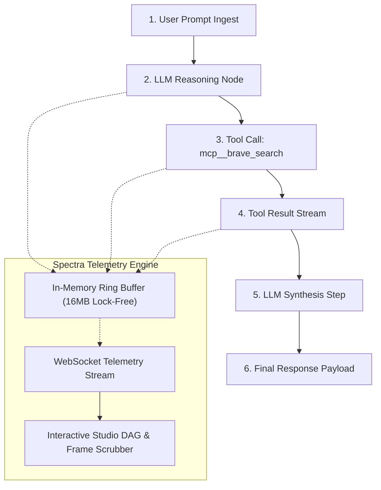

# Spectra

> **Precision Causal DAG Tracing & Deterministic Time-Travel Debugger for AI Tool Workflows.**

[](https://opensource.org/licenses/MIT)
[](https://www.typescriptlang.org/)
[](https://modelcontextprotocol.io/)

---

## What is Spectra?

Debugging autonomous AI agent loops and distributed tool servers is notoriously difficult. When an agent hallucinates, loops in circular retries, or exceeds token budgets, inspecting static terminal logs gives zero visibility into the **causal decision tree**.

**Spectra** is a high-performance, in-memory telemetry and visual debugging engine for AI agent workflows. It renders an **interactive causal DAG graph**, tracks sub-millisecond span latency waterfalls, breaks down prompt vs. completion token burn, and provides a **deterministic time-travel scrubber** to step backwards and forwards through any agent interaction.



---

## Technical Specifications

- **Zero-Allocation Ring Buffer**: Fixed 16MB cyclic buffer in memory adding less than 0.02ms latency per instrumented tool call.
- **Deterministic Time-Travel Replay**: Frame-by-frame scrubbing through complex multi-hop tool execution graphs.
- **Sub-Millisecond Span Latency Waterfall**: Gantt breakdown isolating network wait times vs. LLM generation latencies.
- **Granular Token Attribution**: Prompt vs. completion token consumption tracked down to individual tool calls.
- **Multi-Transport Support**: Stdio, SSE, and WebSocket tracing compatible with Model Context Protocol (MCP), Claude Desktop, Cursor IDE, and custom agent loops.

---

## Quickstart

### 1. Launch the Visual Studio
```bash
npx spectra-trace
# Opens http://localhost:5002 in your browser
```

### 2. Wrap a Tool Server in Claude Desktop / Cursor
In your `claude_desktop_config.json`:

```json
{
  "mcpServers": {
    "filesystem-traced": {
      "command": "spectra-trace",
      "args": ["--port=4567", "--", "npx", "-y", "@modelcontextprotocol/server-filesystem", "/Users/me"]
    }
  }
}
```

### 3. Programmatic Node.js SDK
```typescript
import { SpectraTracer, createSpectraMiddleware } from 'spectra-trace';

const tracer = new SpectraTracer({ ringBufferSize: 65536 });
const spectra = createSpectraMiddleware(tracer);

// Wrap any tool execution with automatic causal DAG telemetry
const result = await spectra.wrapToolCall(
  'trace-session-101',
  'search_database',
  { query: 'SELECT * FROM users WHERE active = true' },
  async () => {
    return await db.query('SELECT * FROM users WHERE active = true');
  }
);
```

---

## Architecture

```
spectra/
├── bin/
│   └── agent-scope.js     # CLI Entrypoint
├── src/
│   ├── tracer.ts          # Ring Buffer Tracing Engine
│   ├── server.ts          # Telemetry WebSocket / HTTP Server
│   ├── middleware.ts      # Zero-Overhead Tool Wrapper
│   └── cli.ts             # Interactive Daemon & Stdio Proxy
├── web/                   # Swiss Minimalist Studio & Causal DAG Visualizer
└── package.json
```

---

## License

MIT License. Designed and engineered by Bhavuk Arora.
