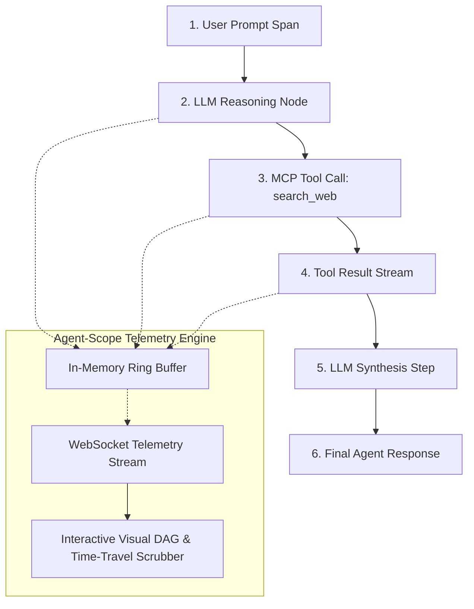

#  Agent-Scope

> **Visual Live Time-Travel Debugger & Execution DAG Inspector for Model Context Protocol (MCP) & Autonomous AI Agents.**

[](https://opensource.org/licenses/MIT)
[](https://www.typescriptlang.org/)
[](https://modelcontextprotocol.io/)

---

##  What is Agent-Scope?

Debugging autonomous AI agents and Model Context Protocol (MCP) tool chains is notoriously hard. When an agent hallucinates, loops in circular queries, or exceeds token budgets, inspecting static log files gives you zero visibility into the **causal decision tree**.

**Agent-Scope** is a lightweight, zero-overhead telemetry and visual debugging suite for AI agents. It renders a **real-time execution DAG**, tracks sub-millisecond span latency waterfalls, breaks down prompt vs. completion token burn, and provides a **deterministic time-travel scrubber** to step backwards and forwards through any agent interaction.



---

##  Core Features

-  **Deterministic Time-Travel Replay**: Drag the scrubber slider to step backwards and forwards through the agent's decision tree step-by-step.
-  **Sub-Millisecond Span Latency Waterfall**: Trace exact execution time per tool call and identify slow database or network bottlenecks.
-  **Token Cost & Context Footprint**: Inspect granular prompt vs. completion token consumption at every hop.
-  **Zero-Config MCP Integration**: Wrap any standard MCP stdio or SSE server with zero code changes.
-  **Real-Time Interactive DAG Studio**: Built-in responsive web dashboard with live SVG node connectors and JSON payload inspection drawers.

---

##  Quickstart

### 1. Launch the Visual Inspector
```bash
npx agent-scope
# Opens http://localhost:4567 in your browser
```

### 2. Wrap an MCP Server in Claude Desktop / Cursor
In your `claude_desktop_config.json`:

```json
{
  "mcpServers": {
    "filesystem-scoped": {
      "command": "agent-scope",
      "args": ["--port=4567", "--", "npx", "-y", "@modelcontextprotocol/server-filesystem", "/Users/me/Documents"]
    }
  }
}
```

### 3. Programmatic Node.js SDK
```typescript
import { AgentTracer, createScopeTracerMiddleware } from 'agent-scope';

const tracer = new AgentTracer();
const scope = createScopeTracerMiddleware(tracer);

// Wrap any tool execution with automatic DAG span telemetry
const result = await scope.wrapToolCall(
  'trace-session-101',
  'search_database',
  { query: 'SELECT * FROM users WHERE active = true' },
  async () => {
    return await db.query('SELECT * FROM users WHERE active = true');
  }
);
```

---

##  Interactive Web Landing Page

The project includes an interactive web demo inspired by editorial typography and minimal high-contrast design (`ryanritzenthaler.com`).

To launch the web interface locally:
```bash
npx serve web
# or open web/index.html in any browser
```

---

##  License

MIT License © 2026 Bhavuk Arora
